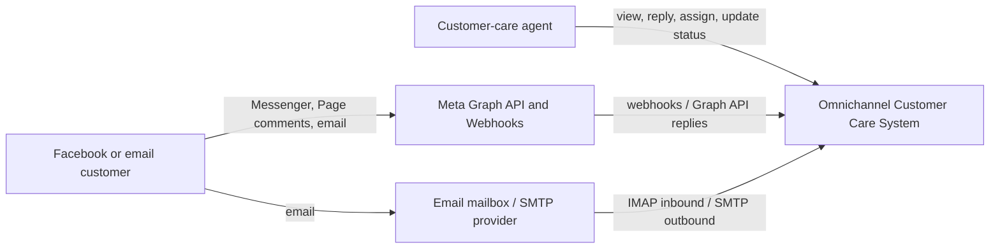
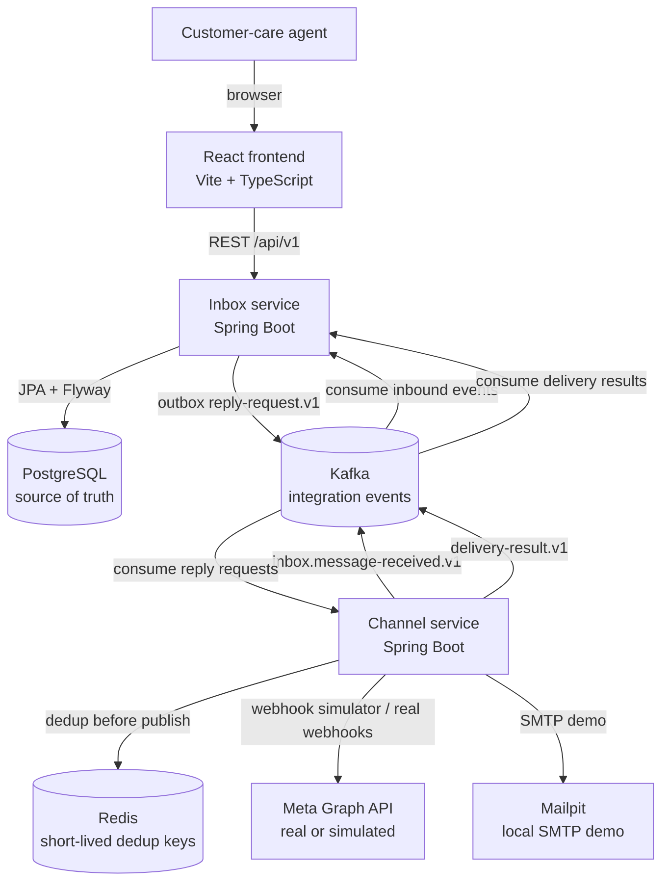
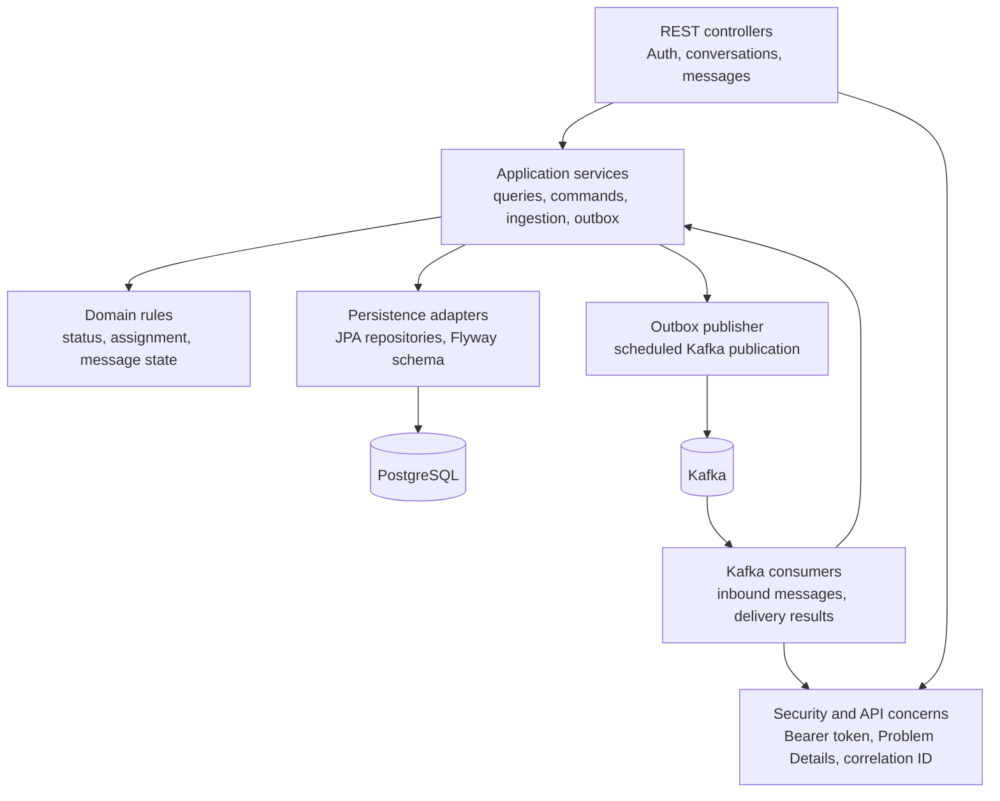
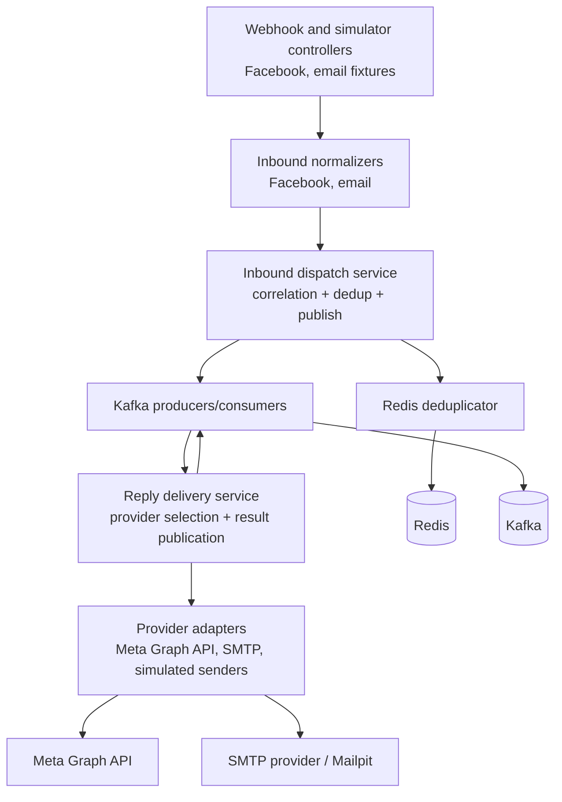

# Architecture Diagrams

Diagrams use Mermaid so they can be reviewed in Git and reused in the report or
slide deck. They describe the current implemented modular-monolith-style demo:
two Spring Boot services plus local infrastructure, not a fully decomposed
microservice platform.

## C4 Context

## C4 Container

## Inbox Service Component View

## Channel Service Component View

