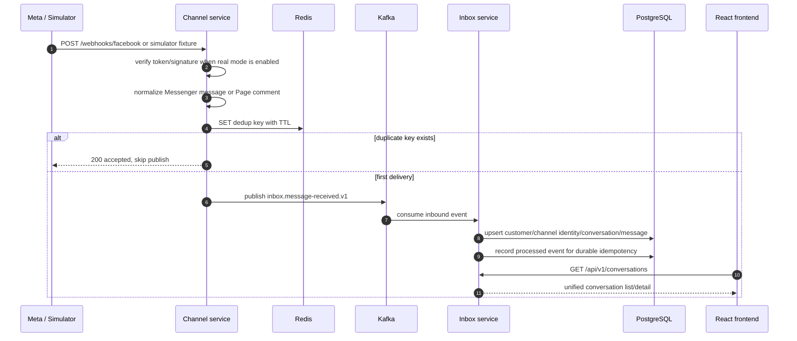
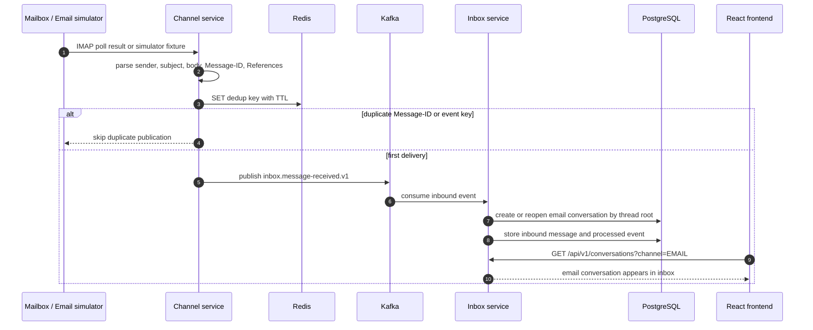
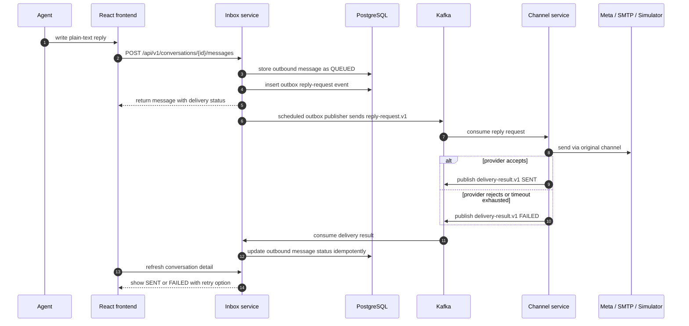

# Sequence Flows

These sequences document the implemented demo flows and the production-facing
adapters they prepare for. Real Meta and live mailbox credentials are still
human-owned setup items.

## Facebook Inbound Message Or Comment

## Email Inbound Message

## Outbound Reply And Delivery Result

